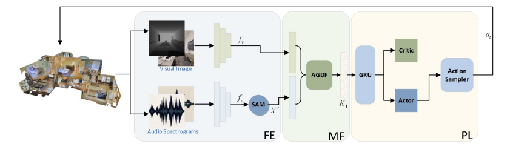

# Audio-Guided Dynamic Modality Fusion with Stereo-Aware Attention for Audio-Visual Navigation

This repository provides the source code for the paper **"Audio-Guided Dynamic Modality Fusion with Stereo-Aware Attention for Audio-Visual Navigation"** (ICONIP 2025).

In audio-visual navigation (AVN) tasks, an embodied agent must autonomously localize a sound source in unknown and complex 3D environments based on audio-visual signals. This work proposes the **AGSA** framework with two key innovations: (1) a **Stereo-Aware Attention Module (SAM)**, which learns and exploits the spatial disparity between left and right audio channels to enhance directional sound perception; and (2) an **Audio-Guided Dynamic Fusion Module (AGDF)**, which dynamically adjusts the fusion ratio between visual and auditory features based on audio cues. Experiments on the Replica and Matterport3D datasets demonstrate significant improvements in navigation success rate and path efficiency.

<p align="center">
  
  <br>
  <em>Figure 1. The overview of Audio-Guided Dynamic Modality Fusion with Stereo-Aware Attention for Audio-Visual Navigation.</em>
</p>

## Installation

### Set up the conda environment

```bash
conda create -n new python=3.6 -y
conda activate new
```

### Install dependences (habitat-lab/habitat-sim)

```bash
git clone https://github.com/facebookresearch/habitat-sim.git
cd habitat-sim
git checkout RLRAudioPropagationUpdate
python setup.py install --headless --audio

git clone https://github.com/facebookresearch/habitat-lab.git
cd habitat-lab
git checkout v0.2.2
pip install -e .
```

### Install soundspaces

```bash
git clone https://github.com/facebookresearch/sound-spaces.git
cd sound-spaces
pip install -e .
```

## Data

```
.
├── ...
├── metadata                                  # stores metadata of environments
│   └── [dataset]
│       └── [scene]
│           ├── point.txt                     # coordinates of all points in mesh coordinates
│           ├── graph.pkl                     # points are pruned to a connectivity graph
├── binaural_rirs                             # binaural RIRs of 2 channels
│   └── [dataset]
│       └── [scene]
│           └── [angle]                       # azimuth angle of agent's heading in mesh coordinates
│               └── [receiver]-[source].wav
├── datasets                                  # stores datasets of episodes of different splits
│   └── [dataset]
│       └── [version]
│           └── [split]
│               ├── [split].json.gz
│               └── content
│                   └── [scene].json.gz
├── sounds                                    # stores all 102 copyright-free sounds
│   └── 1s_all
│       └── [sound].wav
├── scene_datasets                            # scene_datasets
│   └── [dataset]
│       └── [scene]
│           └── [scene].house (habitat/mesh_sementic.glb)
└── scene_observations                        # pre-rendered scene observations
    └── [dataset]
        └── [scene].pkl                       # dictionary is in the format of {(receiver, rotation): sim_obs}
```

## Usage

Below we show the commands for training and evaluating AudioGoal with Depth sensor on Replica, but it applies to the other sensors and Matterport3D dataset as well.

### Training

```bash
python av_nav/run.py --exp-config av_nav/config/replica/train_telephone/audiogoal_depth.yaml --model-dir data/models/replica/audiogoal_depth
```

### Validation (evaluate each checkpoint and generate a validation curve)

```bash
python av_nav/run.py --run-type eval --exp-config av_nav/config/replica/val_telephone/audiogoal_depth.yaml --model-dir data/models/replica/audiogoal_depth
```

### Test the best validation checkpoint based on validation curve

```bash
python av_nav/run.py --run-type eval --exp-config av_nav/config/replica/test_telephone/audiogoal_depth.yaml --model-dir data/models/replica/audiogoal_depth EVAL_CKPT_PATH_DIR data/models/replica/audiogoal_depth/data/ckpt.XXX.pth
```

## Citing

If you use this code in your research, please cite the following paper:

```bibtex
@InProceedings{10.1007/978-981-95-4445-5_24,
author="Li, Jia and Yu, Yinfeng and Wang, Liejun and Sun, Fuchun and Zheng, Wendong",
title="Audio-Guided Dynamic Modality Fusion with Stereo-Aware Attention for Audio-Visual Navigation",
booktitle="Neural Information Processing",
year="2026",
publisher="Springer Nature Singapore",
address="Singapore",
pages="346--359",
}

```
